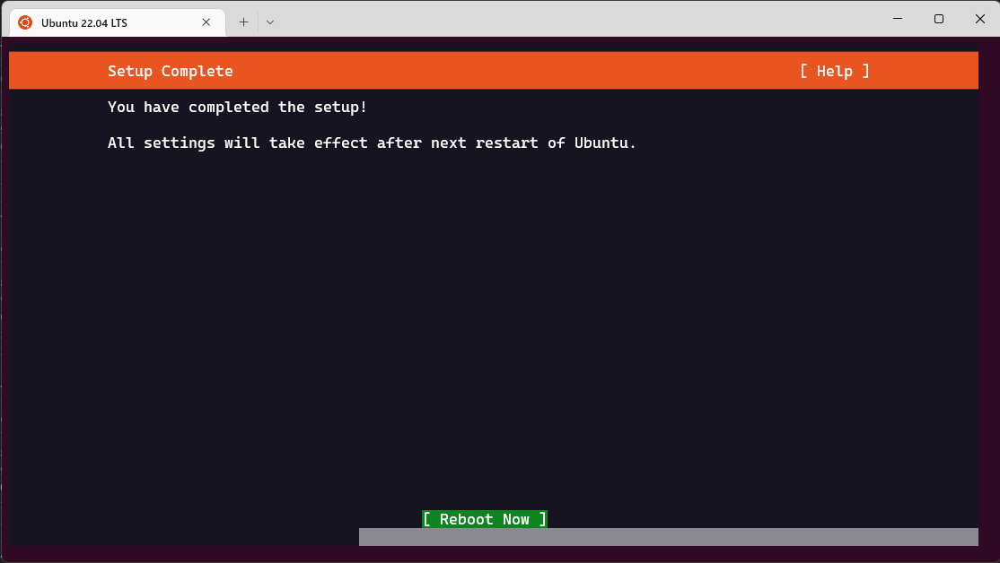

# この記事が目指す目標

Windowsの開発環境において、WSL2を使用することがデファクトスタンダードになりつつある。
しかし、WSL2を使用するにあたって、次の問題に遭遇する人は多いのではないだろうか？

- Systemdが使えない
- WSL2上で仮想マシンを扱いたい


# はじめに

WSL2はコンテナ環境なため、systemdが起動しない（将来的に、WSL2でsystemdを公式にサポートする意思はあるようだ）。
Ubuntuのパッケージマネージャは、従来のaptからsnapに移行していくが、snapはsystemdに依存するため、systemdが起動していないと都合が悪いことが多い。

# 前提環境

WSLから仮想化システム（NestedVM）を利用するため以下の環境が必要です。

- Windows 11

# WSL（Windows Store版）のインストール

WSLでSystemdを使うために、Windows Store版のWSLをインストールします。


# Ubuntu 22.04のインストール

Windows storeからUbuntu 22.04をインストールする。

https://apps.microsoft.com/store/detail/ubuntu-2204-lts/9PN20MSR04DW?hl=ja-jp&gl=JP


# Ubuntu 22.04のセットアップ

Windows TerminalからUbuntu 22.04 LTSを起動し、セットアップを進める。




WSLにログイン時に`/etc/update-motd.d/50-landscape-sysinfo: 17: cannot create /var/lib/landscape/landscape-sysinfo.cache: Permission denied`と表示されることがある。
影響はないようだが、気になる場合は次のコマンドを実行する。

```
sudo apt remove -y landscape-common
sudo apt -yautoremove # Optionally, but recommended
rm ~/.motd_shown
```

# dockerのインストール

全てのシェルからログアウトしておく。

Windows上のDocker Desktopを起動する。

Resources -> WSL Integration から Ubuntu-22.04 を有効にする。

dockerが使用できることを確認する。

``` shell
docker version
docker run ubuntu:14.04 /bin/echo 'Hello world'
```

# WSL 環境の設定

## Systemdの有効化

```
sudo vi /etc/wsl.conf
```

```
[boot]
systemd=true
```

再起動する必要があるかも？？

## resolv.conf の設定

まず、resolv.conf ファイルを確認する。

```
ll /etc/resolv.conf
# /etc/resolv.conf -> ../run/systemd/resolve/stub-resolv.conf
```

エイリアスが張られている場合はファイルを削除する。
エイリアスは、systemd-resolved によるもの。
WSL は、/etc や /home 配下のディレクトリは永続的に保持されるが、/runs 配下は保持されない。

```
sudo rm /etc/resolv.conf
```

resolv.conf を設定する。

```
echo "nameserver 8.8.8.8" | sudo tee /etc/resolv.conf
```

# KVM仮想化の確認

次のコマンドを実行する。

``` shell
sudo apt install -y cpu-checker
```

次のコマンドを実行し、システムがKVM仮想化をサポートしているかどうかを確認する。

``` shell
sudo kvm-ok

# INFO: /dev/kvm exists
# KVM acceleration can be used

egrep -c '(vmx|svm)' /proc/cpuinfo

# 0以上で仮想化対応
```

後ほど導入する`kubevirt`で必要なツールをインストールする。

```
sudo apt install -y qemu-kvm qemu libvirt-clients libvirt-daemon-system
```

KVMの操作に必要な権限を与える。

```
sudo usermod -aG kvm $USER && newgrp kvm
sudo usermod -aG docker $USER

ls -l /dev/kvm
ls -l /var/run/docker.sock
```

仮想マシン作成能力に問題がないことを確認します。

```
virt-host-validate qemu
virsh list
```


# multipassのインストール

次のコマンドを実行する。
KVM仮想化の確認ができない場合は、`multipass`は使用できない。

``` shell
sudo snap install multipass
sudo snap info multipass
```

仮想マシンを起動する。

```
multipass find
multipass launch --name=sample 22.04
```

仮想マシンにログインする。

```
mutlpass shell sample
exit # 仮想マシン上で
```

仮想マシンを削除する。

```
multipass delete sample
multipass purge
```

## プロキシ環境化におけるmultipass

OSイメージを取得する際に外部通信が必要となる。
プロキシ環境化でイメージ取得に失敗する場合は、multipassの実行環境を見直す。

systemdの実行空間でプロキシ設定がなされていない場合は、`/etc/systemd/system/snap.multipass.multipassd.service`を次のような構成にし、systemdを再起動すれば動作するはず。

```
[Service]
EnvironmentFile=/etc/environment
Environment=http_proxy=http://your_proxy
Environment=HTTP_PROXY=http://your_proxy
Environment=https_proxy=http://your_proxy
Environment=HTTPS_PROXY=http://your_proxy
```

# minikubeのインストール

https://minikube.sigs.k8s.io/docs/start/ を参考にインストールを進める。

```
curl -LO https://storage.googleapis.com/minikube/releases/latest/minikube-linux-amd64
sudo install minikube-linux-amd64 /usr/local/bin/minikube
```

必要に応じてminikubeの構成を変更します。

```
minikube version
minikube config set driver docker
# minikube config set driver kvm2
minikube config set memory 4096  # デフォルトは2048
minikube config set container-runtime cri-o  # いらない
```

minikubeを起動する。

```
minikube start
# 指定がないと最新のkubernetesがインストールされるが、1.24では問題が生じたので任意のバージョンを指定
# minikube start --kubernetes-version=v1.23.8
```

`kubectl`をホストにインストールする。

```
VERSION=$(minikube kubectl version | head -1 | awk -F', ' {'print $3'} | awk -F':' {'print $2'} | sed s/\"//g)
sudo install ${HOME}/.minikube/cache/linux/amd64/${VERSION}/kubectl /usr/local/bin
kubectl version
```

`kubectl`の保管を有効化する。

```
echo "source <(kubectl completion bash)" >> ~/.bashrc
```

サンプルアプリケーションをデプロイする。

```
kubectl create deployment hello-minikube --image=k8s.gcr.io/echoserver:1.4
kubectl expose deployment hello-minikube --type=NodePort --port=8080
kubectl get services hello-minikube
minikube service hello-minikube
kubectl port-forward service/hello-minikube 7080:8080
curl http://localhost:7080  # 別端末で
```

```
minikube dashboard --port=33400
curl http://localhost:33400  # 別端末で
```

# krewのインストール

公式手順を参考に`krew`を導入する。

https://krew.sigs.k8s.io/docs/user-guide/setup/install/

```
echo 'export PATH="${KREW_ROOT:-$HOME/.krew}/bin:$PATH"' >> ~/.bashrc
```

krewプラグインが認識されることを確認する。

```
kubectl krew
```


# kubevirtのインストール

- [kubevirt公式手順１](https://kubevirt.io/quickstart_minikube/)

次のコマンドを実行しkubevirtを導入します。

```
export VERSION=$(curl -s https://api.github.com/repos/kubevirt/kubevirt/releases | grep tag_name | grep -v -- '-rc' | sort -r | head -1 | awk -F': ' '{print $2}' | sed 's/,//' | xargs)
echo $VERSION
kubectl create -f https://github.com/kubevirt/kubevirt/releases/download/${VERSION}/kubevirt-operator.yaml
```

```
kubectl create -f https://github.com/kubevirt/kubevirt/releases/download/${VERSION}/kubevirt-cr.yaml
```

kubevirtが展開されるまで待ちます。

```
kubectl get all -n kubevirt
```

# Virtctlのインストール

https://krew.sigs.k8s.io/docs/user-guide/setup/install/

```
VERSION=$(kubectl get kubevirt.kubevirt.io/kubevirt -n kubevirt -o=jsonpath="{.status.observedKubeVirtVersion}")
ARCH=$(uname -s | tr A-Z a-z)-$(uname -m | sed 's/x86_64/amd64/') || windows-amd64.exe
echo https://github.com/kubevirt/kubevirt/releases/download/${VERSION}/virtctl-${VERSION}-${ARCH}
curl -L -o virtctl https://github.com/kubevirt/kubevirt/releases/download/${VERSION}/virtctl-${VERSION}-${ARCH}
chmod +x virtctl
sudo install virtctl /usr/local/bin
virtctl version
```

サンプル仮想マシンをデプロイする。

```
kubectl apply -f https://kubevirt.io/labs/manifests/vm.yaml
kubectl get vms
kubectl get vms -o yaml testvm
```

仮想マシンを起動する。

```
virtctl start testvm
```

※現状は仮想マシンの起動が失敗してしまい、対策できていない。


仮想マシンを停止する。

```
virtctl stop testvm
```


# トラブルシューティング

## Ubuntu 22.04を初期化したい

何らかの理由でUbuntu 22.04を初期化状態に戻したい場合は、次の手順をWindows側で実行する。

Ubuntu 22.04を削除する。

```
wsl --shutdown
wsl --unregister Ubuntu-22.04
```

Docker-DesktopでWSLと統合した場合は、
minikubeのインスタンスがWidowsと共有されている。

不要な場合は、minikubeのインスタンスを削除する。

```
docker ps | grep minikube
docker rm minikube
```

Ubuntu 22.04のセットアップ からやり直す。


# pyenvのインストール

https://github.com/pyenv/pyenv/wiki#suggested-build-environment を参考に前提パッケージをインストール。

```
sudo apt-get update; sudo apt-get install make build-essential libssl-dev zlib1g-dev \
libbz2-dev libreadline-dev libsqlite3-dev wget curl llvm \
libncursesw5-dev xz-utils tk-dev libxml2-dev libxmlsec1-dev libffi-dev liblzma-dev
```

https://github.com/pyenv/pyenv を参考にpyenvをインストール。

```
git clone https://github.com/pyenv/pyenv.git ~/.pyenv
cd ~/.pyenv && src/configure && make -C src
```

```
echo 'export PYENV_ROOT="$HOME/.pyenv"' >> ~/.bashrc
echo 'command -v pyenv >/dev/null || export PATH="$PYENV_ROOT/bin:$PATH"' >> ~/.bashrc
echo 'eval "$(pyenv init -)"' >> ~/.bashrc
```

任意のpythonをインストール。

```
pyenv install 3.8.6
```


# poetryのインストール

https://python-poetry.org/docs/ を参考にインストール。

```
curl -sSL https://raw.githubusercontent.com/python-poetry/poetry/master/get-poetry.py | python -
```

シェルを再起動し次のコマンドを実行。

```
poetry config virtualenvs.create true
poetry config virtualenvs.in-project true
```

# 新しいWindowsを買ったらやること

- パフォーマンスを優先する（以下のみチェックしておくとよい）
    - アイコンの代わりに縮小版を表示する
    - スクリーンフォントの縁を滑らかにする


- 画像やテキストの縁を滑らかにする -> オフ


# ディストリビューションの削除

``` cmd
wsl --list -v
wsl --shutdown
wsl --unregister Ubuntu-22.04
```

# WSL肥大化問題

https://qiita.com/TsuyoshiUshio@github/items/7a745582bbcd35062430

```
docker image prune
docker container prune
docker volume prune
```

```
wsl --shutdown
```


powershellを管理者権限で起動し、windows上の`vhd*`ファイルを検索し、それらしいファイルを最適化する。

```
cd $HOME\..\..  # ドライブルートに移動
Get-ChildItem -Recurse -Force -ErrorAction SilentlyContinue -Filter "*.vhdx" | ForEach-Object { 
  Write-Output "Optimizing: $($_.FullName) Size: $($_.length)"
  optimize-vhd -Mode full -Path $_.FullName
}
```

